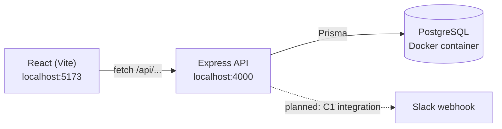
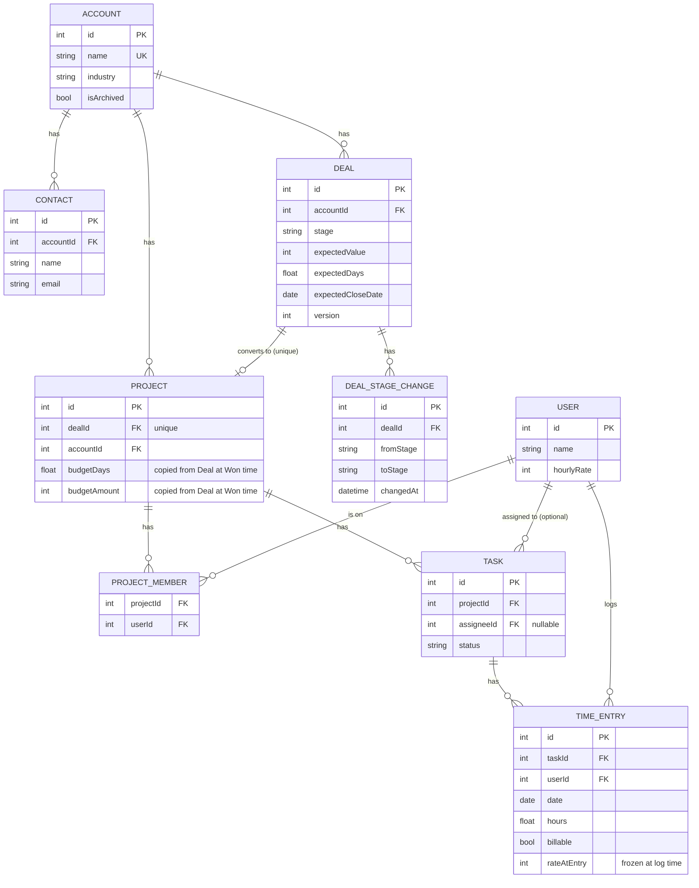

# OneDesk — Design Document

## A1. Architecture sketch

### How the code is split, and why

The backend is split by **responsibility layer**, not by feature module:

- `routes/` — HTTP only. Parse the request, call a service, send a response.
  No business logic lives here.
- `services/` — business rules (`budget.js`, `dealRules.js`, `deals.js`,
  `timeRules.js`, `timeEntries.js`). Each one is a plain function that takes
  data in and returns data or throws an `AppError`. They don't know about
  Express, `req` or `res`, so they can be unit tested without a running
  server (see `budget.test.js`, `dealRules.test.js`).
- `validate.js` / `errors.js` / `errorHandler.js` — shared, boring
  plumbing: turning bad input or a database error into one consistent,
  readable JSON error shape.

I split it this way rather than "by feature" (e.g. one `deals/` folder with
everything deal-related inside) because the brief's core problem is a
handoff between sales and delivery — the interesting logic is in the
**rules** (a deal converts into a project, a budget is calculated, an entry
is validated), not in the routing. Keeping rules in their own layer means
a reviewer can read `services/deals.js` and see the entire deal→project
hinge without wading through Express boilerplate, and it's what makes the
transaction and the tests possible without spinning up HTTP.

### Where business rules live, and how I stop them leaking into the UI

All business rules live in `server/src/services/`. The React client never
decides whether a stage move is legal, whether hours are valid, or how
budget percentages are computed — it only calls the API and displays
whatever comes back (including error messages verbatim). The one exception
is the client mirroring the *allowed next stages* for the deal buttons
(`NEXT` in `Deals.jsx`), which is a UX convenience only: the server
re-validates every stage change independently (`dealRules.js`), so a
tampered or buggy client request is still safely rejected.

### One thing I'd build differently for 200 agencies instead of one

I would replace the single shared Postgres database and `x-user-id` fake
login with real multi-tenancy: a `tenantId` column (or a schema-per-tenant
strategy) on every table, tenant-scoped indexes, and real authentication
that resolves a logged-in user to both their identity and their tenant. Right
now every query implicitly assumes "there is only one agency's data in this
table", which is fine for Brightpath but would leak data across agencies
at 200 tenants.

## A2. Entity-relationship diagram

### Deliberate denormalisation

`Project.accountId` duplicates what's reachable via `Project.dealId →
Deal.accountId`. I kept it so that "all of this account's projects" is a
single indexed query instead of a join through Deal, since that lookup
(account detail page, and the AWS-cost-relevant reporting queries in A3 Q5)
is common and Deal itself is otherwise irrelevant once a project exists.

`Project.budgetDays` / `Project.budgetAmount` duplicate `Deal.expectedDays`
/ `Deal.expectedValue` at the moment of conversion. This one isn't really
denormalisation for query convenience — it's a deliberate snapshot, and
the reasoning is in A3 Q1 below.