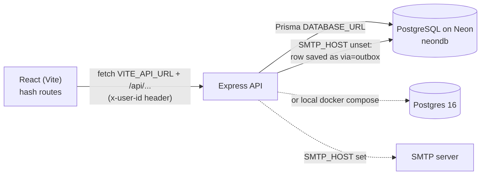
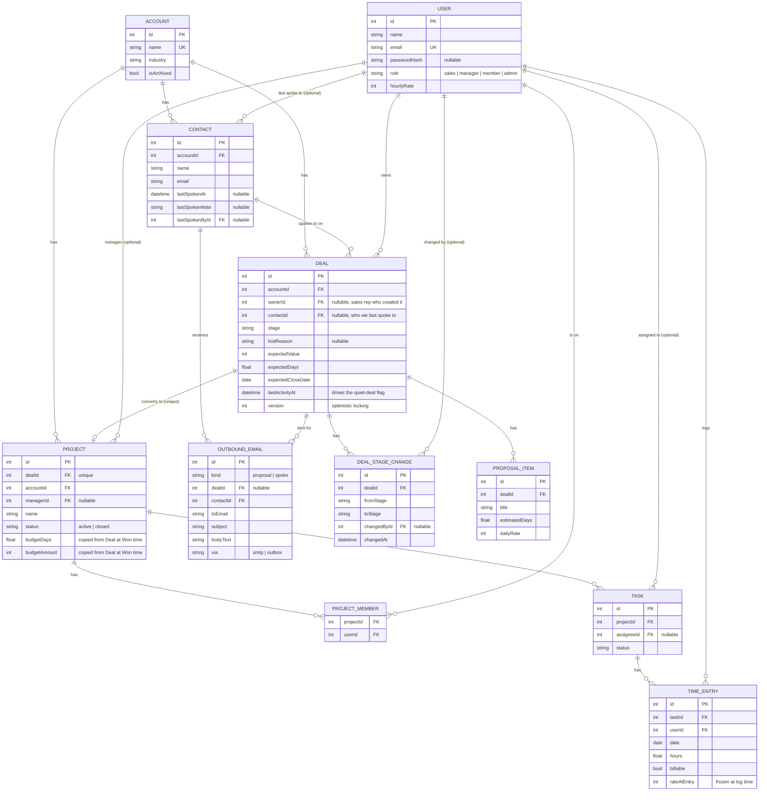

# OneDesk — Design Document

## A1. Architecture sketch

Prisma's `provider` is `postgresql` — Neon is hosted Postgres, not a
different dialect. The live tables are in Neon project
`twilight-sunset-97887745`, database `neondb`. Locally you can instead
point `DATABASE_URL` at `docker-compose.yml`'s Postgres 16. Neon URLs
need `sslmode=require`.

Locally Vite proxies `/api` to `http://127.0.0.1:4000`. In production the
client must be built with `VITE_API_URL` pointing at the hosted API
(`client/src/api.js`); `cors({ origin: "*" })` is on so a Vercel frontend
can call a separate API host.

The repo is two npm packages, matching `client/package.json` and
`server/package.json` — not a monorepo workspace. The server's production
entry is `npm start` (`node src/index.js`); `npm run dev` is nodemon.
Mail goes through `nodemailer` only when `SMTP_HOST` is set; otherwise
`outbound.js` writes an `OutboundEmail` row. Passwords use `bcryptjs`.
The client has no React Router dependency: `App.jsx` reads
`window.location.hash`.

### How the code is split, and why

The backend is split by **responsibility layer**, not by feature module:

- `routes/` — HTTP only. Parse the request, call a service, send a response.
  A thin `authz.js` middleware (`salesOnly` / `deliveryOnly` / `adminOnly`)
  gates each router before its handlers run, so a route file never has to
  re-check "is this person allowed here" itself.
- `services/` — business rules (`budget.js`, `dealRules.js`, `deals.js`,
  `timeRules.js`, `timeEntries.js`, `forecast.js`, `mail.js`, `outbound.js`).
  Each one is a plain function that takes data in and returns data or throws
  an `AppError`. They don't know about Express, `req` or `res`, so they can
  be unit tested without a running server (see `budget.test.js`,
  `dealRules.test.js`, `forecast.test.js`, `mail.test.js`, ...).
- `validate.js` / `errors.js` / `errorHandler.js` — shared, boring
  plumbing: turning bad input or a database error into one consistent,
  readable JSON error shape.

I split it this way rather than "by feature" (e.g. one `deals/` folder with
everything deal-related inside) because the brief's core problem is a
handoff between sales and delivery — the interesting logic is in the
**rules** (a deal converts into a project, a budget is calculated, an entry
is validated, a proposal email is built), not in the routing. Keeping rules
in their own layer means a reviewer can read `services/deals.js` and see
the entire deal→project hinge without wading through Express boilerplate,
and it's what makes the transaction and the tests possible without
spinning up HTTP.

### Where business rules live, and how I stop them leaking into the UI

All business rules live in `server/src/services/`. The React client never
decides whether a stage move is legal, whether hours are valid, or how
budget percentages are computed — it only calls the API and displays
whatever comes back (including error messages verbatim). The one exception
is the client mirroring the *allowed next stages* for the deal buttons
(`NEXT` in `DealDetail.jsx`) and the *allowed nav items* for a role
(`roles.js`), which are UX convenience only: the server re-validates every
stage change independently (`dealRules.js`) and every route independently
(`authz.js`), so a tampered or buggy client request is still safely
rejected.

Delivery has a second gate inside those routes: `canManageDelivery` (role
`manager` or `admin`) may add members, create/assign/delete tasks, and
close a project. A `member` may only view projects they belong to, change
status on their own tasks, and log time when `Task.assigneeId` is them
(`services/timeEntries.js`). Team progress (all tasks + budget) is still
returned on `GET /projects/:id` so the whole team can see how the job is
going.

### Registration, rates, and seed

Registration (`POST /api/auth/register`) requires name, email, password
(≥ 6 chars), role, and **hourly rate** (whole rupees/hour, 0–100000). There
is no seed file that inserts demo people: `prisma/seed.js` only deletes
every table. The first account may register as `admin` if none exists
(`GET /api/auth/bootstrap` → `{ allowAdmin }`); later signups are
`sales | manager | member` only. `PATCH /api/admin/people/:id` lets an
admin change a stored rate without touching already-frozen `rateAtEntry`
values.

### Forecast and proposals

Forecast is server-side (`services/forecast.js`): “this quarter” is the
UTC calendar quarter of `now`. Only non-lost deals whose
`expectedCloseDate` falls in `[start, end)` are weighted (new 10%,
qualified 35%, proposal_sent 60%, won 100%). Quiet means 120 days without
activity on an open deal.

A new deal always gets one `ProposalItem` copied from its days and value
so sales do not type the same size twice. Extra lines are optional. The
deal detail screen emails the proposal; a separate call follow-up stays
on the account’s contact list.

### Where authentication actually stops

Registration and login are real — passwords are hashed with bcrypt and
checked in `routes/auth.js` — but the result of a successful login is just
a plain user object. The client keeps that user's `id` in `localStorage`
and resends it as an `x-user-id` header on every request; `app.js`'s
first middleware trusts that header completely and loads the matching
user. There's no signed token, so this is authentication without a real
session: it stops casual misuse (you can't act as someone without knowing
or guessing their numeric id) but not someone editing `localStorage` in
devtools. I called this out explicitly rather than papering over it — see
A3 Q4 for what replacing it would take.

### One thing I'd build differently for 200 agencies instead of one

I would replace the single shared Postgres database with real
multi-tenancy: a `tenantId` column (or a schema-per-tenant strategy) on
every table, tenant-scoped indexes, and the real session from A3 Q4
resolving a logged-in user to both their identity and their tenant. Right
now every query implicitly assumes "there is only one agency's data in this
table", which is fine for Brightpath but would leak data across agencies
at 200 tenants.

## A2. Entity-relationship diagram

### Deliberate denormalisation

`Project.accountId` duplicates what's reachable via `Project.dealId →
Deal.accountId`. I kept it so that "all of this account's projects" is a
single indexed query instead of a join through Deal, since that lookup
(account detail page, and the AWS-cost-relevant reporting queries in A3 Q5)
is common and Deal itself is otherwise irrelevant once a project exists.

`Project.budgetDays` / `Project.budgetAmount` duplicate `Deal.expectedDays`
/ `Deal.expectedValue` at the moment of conversion. This one isn't really
denormalisation for query convenience — it's a deliberate snapshot, and
the reasoning is in A3 Q1 below.

`TimeEntry.rateAtEntry` similarly freezes `User.hourlyRate` at the moment
someone logs an hour, for the same reason as the budget snapshot: a raise
next month shouldn't silently change what a client was already billed for
last month's work.

## A3. Written answers

### Q1. Why copy the budget onto the Project instead of reading it live off the Deal?

`Project.budgetDays` / `Project.budgetAmount` are a snapshot taken the
moment a deal is marked Won (`services/deals.js`, `changeStage`), not a
live reference to `Deal.expectedDays` / `Deal.expectedValue`. I did this
deliberately rather than by accident:

- **A deal shouldn't even be editable once it's a project.** `PATCH
  /api/deals/:id` already refuses to edit a `won` deal ("A won deal cannot
  be edited. Delivery owns it now."), so in the current code the two
  numbers can't drift apart after conversion anyway. The snapshot is a
  belt-and-braces guarantee of that same intent at the data layer, not
  just the API layer — if a future migration or admin script ever touched
  a won deal's numbers directly, the already-reported project budget
  would still be safe.
- **The two numbers mean different things.** `Deal.expectedValue` is *what
  sales thinks this is worth*, which is allowed to be a moving target
  right up until the deal is won. `Project.budgetAmount` is *what was
  actually sold and reported to the client*, which by definition has to
  stop moving at the exact instant the deal converts. Collapsing them into
  one live-referenced number would make it impossible to tell, later,
  which one you're looking at.
- **It matches how the business already works.** A won deal isn't "sales
  data with a status flag", it's a contract. Once Brightpath tells a
  client "this is a 20-day, ₹4,00,000 engagement", that number is fixed
  regardless of what sales later realises the deal was actually worth (for
  their own pipeline reporting, say).

The trade-off is the usual one for a snapshot: if the *sold* scope
genuinely changes after the fact (a change order, a renegotiated scope),
there's no built-in way to update `Project.budgetDays/budgetAmount` today
— someone would have to do it by hand. I'd rather have that be a
deliberate, visible admin action (an explicit "revise budget" endpoint
that also writes a `BudgetRevision` row, mirroring how `DealStageChange`
already tracks deal history) than let the number silently drift because it
was never actually copied in the first place.

### Q2. How do you stop two people from clobbering the same deal at once?

Sales is a small team working the same handful of accounts, so two people
editing the same deal at once is a real scenario, not a hypothetical —
e.g. a manager moves a deal to Lost while the rep is mid-edit adding a
proposal line item. `Deal.version` is an integer that increments on every
write. `changeStage` (and `PATCH /api/deals/:id`) takes the version the
client last saw and does the update as `updateMany({ where: { id, version:
deal.version } , data: { version: { increment: 1 }, ... } })` — an
atomic **compare-and-swap** at the database level, not a
read-then-check-then-write in application code that could itself race.
If `result.count === 0`, someone else's write already moved the version
out from under this request, and the caller gets a 409 with a "please
refresh and try again" message instead of a silent overwrite.

This is optimistic rather than pessimistic (no row locking, no "someone
else is editing this" banner) because deal edits are infrequent and short
— a lock held across a user thinking about what to type would cost more
in blocked colleagues than the rare real conflict costs in a redone edit.
Time entries use a different strategy for a similar problem (two entries
for the same person/day pushing the daily total over 24h): a `Serializable`
transaction in `logTime`/`updateTime`, because that check depends on a
*sum* of other rows rather than a single row's version, so there's no
single version number to compare-and-swap on.

### Q3. Time entries can be edited and deleted, but there's no history. How would you extend it for disputes?

Right now `updateTime`/`deleteTime` (`services/timeEntries.js`) mutate or
remove the `TimeEntry` row in place. That's fine for "I fat-fingered
6 hours instead of 4 an hour ago", but it means a project manager
reconciling a client dispute six weeks later has no way to see that an
entry used to say something different, or that one existed at all before
it was deleted. Deals already solve the equivalent problem with
`DealStageChange`; I'd do the same shape here:

1. Add a `TimeEntryChange` table: `timeEntryId`, `field`, `oldValue`,
   `newValue`, `changedById`, `changedAt` (or simpler, one row per edit
   with the whole before/after JSON — cheaper to write, slightly more
   annoying to query one field's history from).
2. In `updateTime`, inside the existing transaction, write one
   `TimeEntryChange` row before applying the update, using the same
   before/after values already being diffed for the Prisma `update` call.
3. In `deleteTime`, instead of `prisma.timeEntry.delete`, set a
   `deletedAt` timestamp (soft delete) and write a final
   `TimeEntryChange` row. `calculateBudget` and the project view would
   filter `deletedAt: null`, so a deleted entry stops counting against the
   budget immediately, but the row (and its full history) is still there
   for an audit.
4. Surface it in `ProjectDetail.jsx` as a small "edited"/"deleted" tag with
   a hover/expand for the history, visible to a manager but not
   required reading for the day-to-day timesheet view.

I didn't build this for the assignment because every failure case I chose
to handle end-to-end (see README) was about *preventing* bad data, and
this is about *auditing changes to already-valid* data — a real gap, but a
different kind of problem, and one row of history per edit is cheap to add
later without touching the validation rules in `timeRules.js` at all.

### Q4. Auth checks a real password but the session is just a header. What would shipping this actually need?

`routes/auth.js` does real password hashing (bcrypt) and a real check on
login. What happens *after* that is not real: the client stores the
returned user's `id` in `localStorage` and sends it back as `x-user-id` on
every request (`client/src/api.js`), and `app.js`'s first middleware
trusts that header completely. This is enough to demo and test every
role-based feature in this project, but it has two concrete holes:

- **No proof of identity after login.** Anyone with devtools open can set
  `localStorage`'s `userId` to any other number and the server will treat
  them as that user — there's nothing tying the header to the password
  check that happened earlier.
- **No expiry.** Even if this were a real token, there's currently no
  concept of it going stale, being revoked, or a user being logged out
  server-side.

To ship this, I'd replace the header with a signed, short-lived JWT (or a
server-side session cookie — a cookie is simpler to get right for a
same-origin app like this one, since it sidesteps `localStorage` being
readable by any script on the page): `POST /api/auth/login` sets an
`httpOnly`, `sameSite=lax` cookie instead of just returning the user; the
`app.js` middleware verifies that cookie's signature instead of trusting a
plain header; and `/api/auth/logout` clears it. I'd keep `authz.js`
completely unchanged — it already only cares about `req.user`, not about
how `req.user` got populated, which is exactly the point of putting it in
its own layer (see A1).

### Q5. `calculateBudget` sums time entries in memory. What breaks at 2 million rows, and what's the fix?

`GET /api/projects` and `GET /api/projects/:id` both load every
`TimeEntry` for a project (or, for the list view, every project's
entries) into Node and reduce over them in `services/budget.js`. At
current demo scale (a handful of projects, a few hundred entries each) that's
simpler to read and unit-test than an equivalent SQL query, and
`budget.test.js` can hand it a plain in-memory array — which is exactly
the payoff of keeping this logic out of `routes/` from A1. At Brightpath's
actual multi-year, multi-project scale it stops being viable: pulling
every historical row for a project every time someone opens its page is
wasted I/O and JSON-serialization cost that grows without bound, and the
list endpoint would do it once *per project* on one page load.

What I'd change:

1. Replace the in-memory `for` loop with a single `groupBy`/aggregate
   query — `SELECT billable, SUM(hours), SUM(hours * "rateAtEntry")
   FROM "TimeEntry" JOIN "Task" ... WHERE "Task"."projectId" = $1 GROUP BY
   billable` (Prisma's `groupBy` can express this) — so Postgres does the
   summation using the existing `@@index([taskId, billable])` index
   instead of Node iterating every row.
2. `firstOverrunDate` genuinely needs the entries in date order to find
   the first day the running total crossed the budget, so it can't be
   reduced to one aggregate query the same way; I'd keep it as a
   date-ordered, indexed query (`@@index([userId, date])` already exists;
   I'd add `[taskId, date]`) but stop pulling *all* entries for it —
   just enough, in date order, to find the crossing point and stop, rather
   than materialising the whole history to scan it in JS.
3. For the project *list* view specifically, I'd precompute and cache
   `burnedDays`/`burnedAmount` on the `Project` row itself, updated
   incrementally in the same transaction that creates/edits/deletes a
   `TimeEntry` (all three already go through `services/timeEntries.js`, so
   there's one place to add it), rather than recomputing the sum for every
   project on every list load.

I'd only do (1) and (2) up front — they're a rewrite of one function
behind an interface (`calculateBudget(project, entries)`) that's already
unit-tested in isolation, so nothing calling it needs to change. (3) is
the one I'd hold off on until it was actually needed, since a cached
column that can drift from the source of truth is exactly the kind of bug
class this project otherwise goes out of its way to avoid (see the
`budgetDays`/`budgetAmount` snapshot in Q1, which is a *deliberately*
frozen copy with a clear reason, not an incrementally-updated cache that
could silently skew).